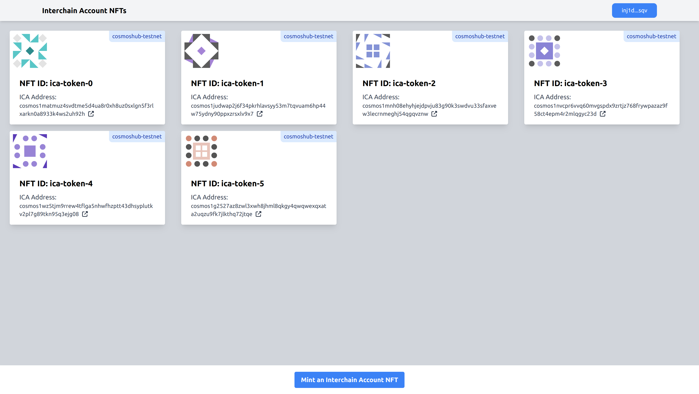
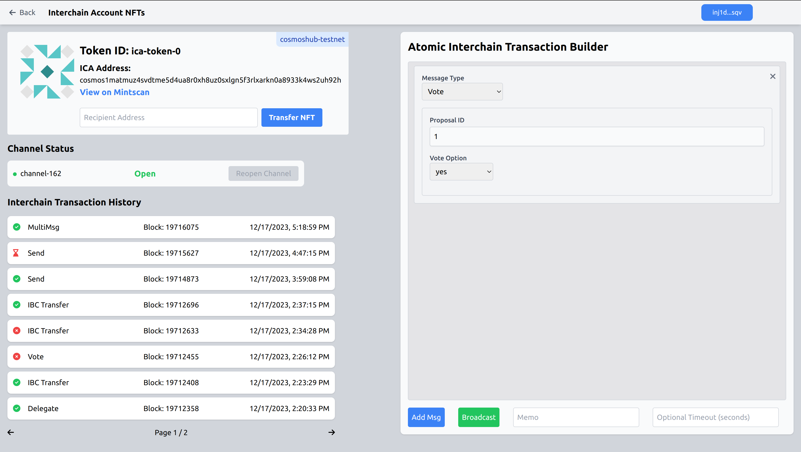

# Injective NFT-ICA Frontend

## Overview

This is a frontend for the Injective [NFT-ICA application](https://github.com/srdtrk/cw-nft-ica). It is built based on the next/react [Injective Counter Contract Example](https://github.com/InjectiveLabs/injective-simple-sc-counter-ui). This frontend is only intended to be used in the testnet. For a full overview of the project go to the [parent repository](https://github.com/srdtrk/cw-nft-ica).

## Motivation

This application was built for the [Injective Illuminate Hackathon](https://dorahacks.io/hackathon/illuminate/detail).

## Setup

To use the frontend, you can visit [here](). To run the front end locally, fill in a `.env.local` file as in [`.env.example`](./.env.example) and run the following command.

```
npm run dev
```

For this application to run correctly, a relayer must be running with the NFT-ICA application. It must relay all packets between `theta-testnet-001` and `injective-888`. A relayer configuration file and setup guide can be found in the [parent repo](https://github.com/srdtrk/cw-nft-ica). I would've liked to run my own relayer at all times while the judges are checking out the application, however, since the judging period is not clear, and running a relayer is costly and unstable with free APIs, I cannot guarantee that a relayer will be up, unless the judges what to coordinate with me. For this, you can either contact me directly or create an issue in any of the repos.

## Pictures






## IBC Connections

The contracts use the following IBC light clients and connections in case you'd like to run your own relayer with your own configuration file. 

```rust
SUCCESS Connection {
    delay_period: 0ns,
    a_side: ConnectionSide {
        chain: BaseChainHandle {
            chain_id: ChainId {
                id: "injective-888",
                version: 888,
            },
            runtime_sender: Sender { .. },
        },
        client_id: ClientId(
            "07-tendermint-194",
        ),
        connection_id: Some(
            ConnectionId(
                "connection-184",
            ),
        ),
    },
    b_side: ConnectionSide {
        chain: BaseChainHandle {
            chain_id: ChainId {
                id: "theta-testnet-001",
                version: 0,
            },
            runtime_sender: Sender { .. },
        },
        client_id: ClientId(
            "07-tendermint-2602",
        ),
        connection_id: Some(
            ConnectionId(
                "connection-2963",
            ),
        ),
    },
}
```

I've also created a transfer channel between the two chains for testing with channel id `channel-160` on the Injective chain and `channel-3440` on the Cosmos Hub Theta Testnet.
